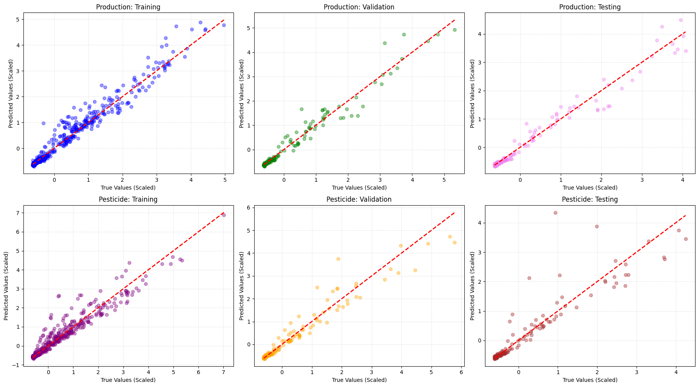
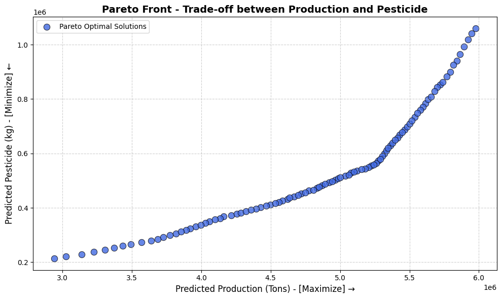

# ann-nsga3-crop-optimization
ANN surrogate-assisted multi-objective optimization of rice production and pesticide use using NSGA-III.

# ANN-Assisted Multi-Objective Optimization of Rice Production using NSGA-III

This project develops a surrogate-assisted optimization framework for agricultural decision-making by combining an **Artificial Neural Network (ANN)** with **NSGA-III multi-objective optimization**.

The ANN is trained on a processed pan-India agricultural dataset to predict **rice production** and **pesticide usage**, and the trained model is then used as a surrogate objective evaluator inside NSGA-III to explore production–pesticide trade-offs.

## Project Objectives

- Build a predictive ANN for rice production and pesticide usage.
- Reduce the high-dimensional categorical agricultural dataset into a compact modelling representation.
- Use the trained ANN as a surrogate model inside NSGA-III.
- Maximize agricultural production while minimizing pesticide usage.
- Generate Pareto-optimal operating points for multi-objective decision support.

## Dataset & Preprocessing

The original dataset contained multiple crops and states across India, producing a high-dimensional feature space after categorical encoding.

The modelling workflow was restructured to control this dimensionality and produce a **12-feature input representation** for rice-specific modelling.

After preprocessing and filtering, the final dataset contained approximately:

- **1,193 usable rice-production observations**
- **12 ANN input features**
- Two prediction targets:
  - Rice production
  - Pesticide usage

The data were split into training, validation and test sets.

## ANN Architecture

The surrogate neural network uses the architecture:

```text
Input (12 features)
        ↓
Dense 128
        ↓
Dense 64
        ↓
Dense 32
        ↓
Output (2 targets)
```

ReLU activations and dropout were used in the hidden layers, with Adam optimization and early stopping during training.

## Model Performance

The trained ANN achieved:

Production prediction: Test R² ≈ 0.972
Pesticide prediction: Test R² ≈ 0.855

These results indicate that the surrogate model captures the production response particularly well while retaining useful predictive capability for pesticide usage.

### ANN Prediction Performance

The ANN surrogate was evaluated across training, validation and test sets for both prediction targets. The final model achieved test R² values of approximately **0.972 for rice production** and **0.855 for pesticide usage**.



## Multi-Objective Optimization

The trained ANN was coupled with NSGA-III using pymoo.

Decision variables
Cultivated area
Annual rainfall
Fertilizer application
Objectives
Maximize rice production
Minimize pesticide usage

The optimizer evaluates candidate agricultural configurations using the ANN surrogate rather than repeatedly fitting or querying a more expensive model.

## Pareto Optimization

NSGA-III generates a set of non-dominated solutions representing the trade-off between:

higher agricultural production, and
lower pesticide usage.

Rather than returning a single optimum, the Pareto front provides multiple feasible decision alternatives depending on the relative importance assigned to productivity and environmental input reduction.

### Production–Pesticide Pareto Front

The trained ANN was coupled with NSGA-III to identify non-dominated agricultural configurations balancing higher predicted rice production against lower predicted pesticide usage.



Each point represents a Pareto-optimal solution rather than a single prescribed operating condition, allowing alternative decisions to be selected according to the desired productivity–environmental trade-off.

## Research Workflow

```text
Raw Agricultural Dataset
        ↓
Filtering & Structured Preprocessing
        ↓
12-Feature Rice Dataset
        ↓
ANN Surrogate Model
        ↓
Model Validation
        ↓
NSGA-III Optimization
        ↓
Pareto-Optimal Production–Pesticide Trade-offs
Tools
Python
NumPy
Pandas
Matplotlib
Scikit-learn
TensorFlow / Keras
pymoo
NSGA-III
Jupyter Notebook
Repository Structure
.
├── ANN_NSGA3_Crop_Optimization.ipynb
├── README.md
├── requirements.txt
├── .gitignore
└── LICENSE
```
## Limitations

This project is a surrogate-assisted optimization study and does not establish causal relationships between agricultural inputs and outcomes.

The optimization results depend on:

- the quality and coverage of the underlying dataset
- the predictive reliability of the ANN
- the selected decision-variable bounds
- the assumed relationship between the model inputs and pesticide usage.

Future work could include uncertainty quantification, SHAP-based interpretability, alternative surrogate models, and validation using external agricultural datasets.

### Author

Maitrey Patankar
M.Tech Sustainable Engineering, IIT Hyderabad
